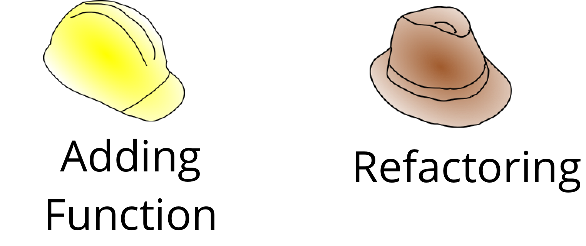

# Introduction

> _The process of restructuring existing code or changing the factoring—without changing its behavior_

Software programmers spend most of the time either reading or writing the code. The amount of time spent on the former is substantially high compared to the latter. Another intresting fact about the average lifespan of a software program ranges from 6-8 years, and in some complex enterprise applications, it can even go beyond a decade. The ease with which one can maintain a software program is inversely proportional to its age and complexity. Studies have shown that over 90% of the cost spent on maintainability.

> "Neglection accelerates the rot faster than any other factor." says the authors of the book "The Pragmatic Programmer"

What a lovely quote! It is so true about everyday things in our lives. If we do not care, who else will? They say, _"Attitudes are contagious. Are yours worth catching?"_ If one person shows the attitude of neglection and so the other will. However, if one dares to pause and show that he/she care, soon the others would join the party. All it takes is the desire to be proud of what he/she does.

When we code, we programmers are in a hurry chasing the solution. In doing so, we miss out on practices, patterns, principles, conventions, and much more. This haste costs us badly during the enhancements and maintenance. Time and again, we have seen the tiger team delivers with commendable pace in the first few months. Soon, they struggle to keep up with the pace as they start carrying the luggage. We call it in a fancy way "Technical Debt."

Uncle Bob quotes in one of my all-time favorite books [Clean Code](https://www.amazon.in/Clean-Code-Robert-C-Martin/dp/8131773388).

> "The only way to make the deadline — the only way to go fast — is to keep the code as clean as possible at all times."

Let's begin our journey...

> **Continuous Care, Continuous Refactoring is the key for the maintainable code.**

This is my attempt to understand and practice the refactoring techniques that Martin Fowler beautifully crafted in his book

[Refactoring: Improving the Design of Existing Code](https://martinfowler.com/books/refactoring.html).

This is just for my reference. In no way do I claim this as my work; it is all the efforts of Martin Fowler. So if you really want to learn deeper about refactoring, buy and read the book and use this repository just as a reference.

If you are the publisher and think this repository should not be public, write me an email at bharat.mane \[at\] gmail \[dot\] com, and I will make it private.

Contributions: Issues, comments, and pull requests are super welcome 😃

      

## Table of Contents \#\#

* [Introduction](docs.md#introduction)
* [Techniques](docs.md#Techniques)
* [License](docs.md#license)

### Tests are your friends else you are in trouble \#\#\#

> _Refactoring is **not** adding the behavior, but it is all about **preserving** it._

In other words, it is changing the internal structure without changing the external behavior. Invest now, and be rest assured it will payback. While we refactor, a word of caution, remember that we are making changes to something that works just fine. Change always comes at a cost. There could be numerous ways we can break perfectly working code during refactoring. There is the only way that would guarantee the refactoring would not cause any trouble, and that is the first tip from Martin Fowler.

> _1. Before you start refactoring, make sure you have a solid suite of tests._

